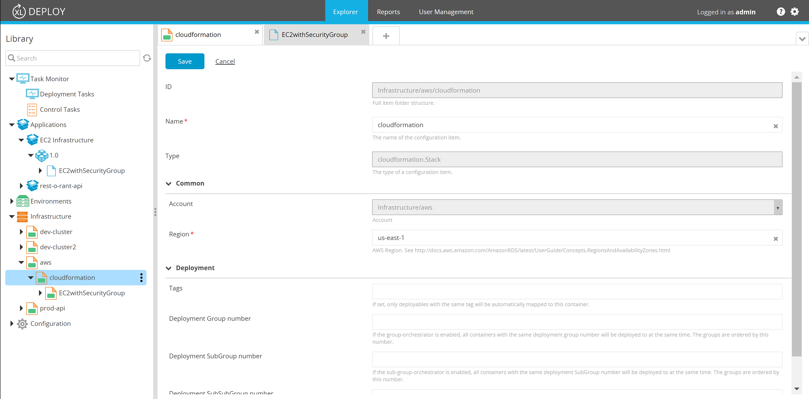
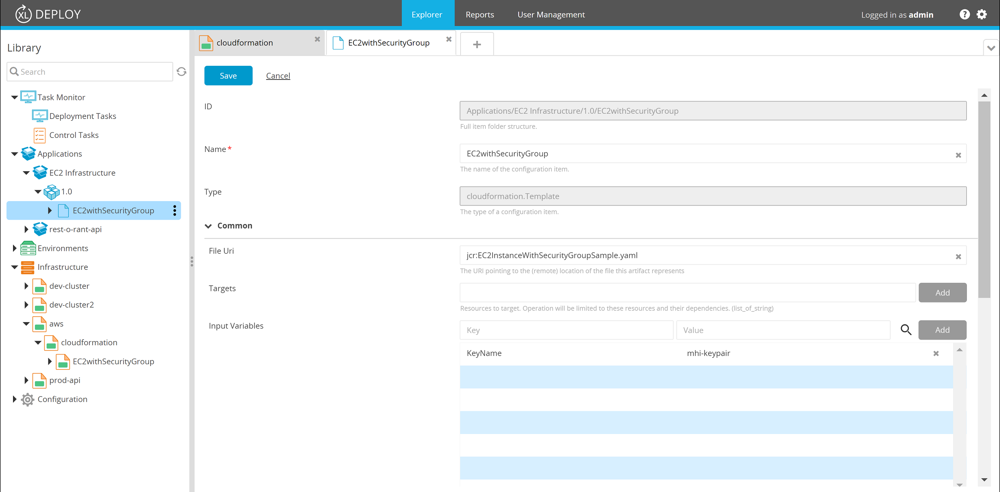

# XLD AWS CloudFormation Plugin

[](https://travis-ci.org/xebialabs-community/xld-cloudformation-plugin)
[](https://www.codacy.com/app/erasmussen39/xld-cloudformation-plugin?utm_source=github.com&amp;utm_medium=referral&amp;utm_content=erasmussen39/xld-cloudformation-plugin&amp;utm_campaign=Badge_Grade)
[](https://codeclimate.com/github/erasmussen39/xld-cloudformation-plugin/maintainability)
[](https://opensource.org/licenses/MIT)
[![Github All Releases][xld-cloudformation-plugin-downloads-image]]()

[xld-cloudformation-plugin-downloads-image]: https://img.shields.io/github/downloads/xebialabs-community/xld-cloudformation-plugin/total.svg

## Overview
This plugin enables AWS CloudFormation deployments from XL Deploy.

## Requirements ##

* XL Deploy Server 7+
* XL Deploy AWS plugin

## Installation

The plugin JAR file can be downloaded from [releases](https://github.com/xebialabs-community/xld-cloudformation-plugin/releases).
Copy the downloaded JAR into the `SERVER_HOME/plugins` directory of XL Deploy.

# Usage

## CloudFormation Stack

Define the information about the CloudFormation stack,  ___cloudformation.Stack___, as a child of an ___aws.Cloud___ configuration item under the ___Infrastructure___ node.



## CloudFormation Deployed Template

Define the CloudFormation deployed template, ___cloudformation.DeployedTemplate___ in a ___udm.DeploymentPackage___.



## Automatically Creating XL Deploy Configuration Items

The plugin is capable of creating configuration items in XL Deploy after CloudFormation stack creation.  This can be useful if you create hosts and deployment containers (middleware) with CloudFormation and then subsequently want to deploy application or services using XL Deploy.

The CI information is defined in Metadata element of the CloudFormation template.  Any kind of configuration element can be created.  In addition, dynamic properties can be inserted at runtime using property placeholders.  Placeholders are signified by {..} surrounding the placeholder name e.g. {Address} below.

```
"Metadata": {
    "XLD::Infrastructure" : [
        {
            "id": "cloud",
            "type": "core.Directory",
        },
        {
            "id": "cloud/webserver",
            "type": "overthere.SshHost",
            "os": "UNIX",
            "connectionType": "SFTP",
            "address": "{Address}",
            "port": "22",
            "username": "admin"
        },
        {
            "id": "cloud/webserver/tc",
            "type": "tomcat.Server",
            "home": "/opt/local/tomcat",
            "startCommand": "service tomcat start",
            "stopCommand": "service tomcat stop",
            "startWaitTime": 0,
            "stopWaitTime":0
        },
        {
            "id": "cloud/webserver/tc/public",
            "type": "tomcat.VirtualHost",
            "appBase": "webapps",
            "hostName": "public"
        }
    ],
    "XLD::Environments" : [
        {
            "id": "cloud-dev",
            "type": "udm.Environment",
            "members": [ {"ci ref": "Infrastructure/cloud/webserver/tc/public"} ]
        },
    ]
}
```

Here is an example Outputs section of a CloudFormation template.  Notice the 'Address' variable.  The value of this variable will be substituted into the above template at runtime.

```
"Outputs" : {
    "URL" : {
    "Value" : { "Fn::Join" : [ "", ["http://", { "Fn::GetAtt" : ["WebServerInstance", "PublicIp"] }]]},
    "Description" : "Newly created application URL"
    },
    "Address": {
    "Value" : { "Fn::GetAtt" : ["WebServerInstance", "PublicIp"] },
    "Description" : "Host IP address"
    }
}
```


## Development ##

### Setting up AWS credentials ###

Create an `itest-conf.json` file in this projects root folder defining the following content with that for your AWS account.

```
[ {
    "name": "aws_cloud",
    "accesskey": "xxxxxxxxx",
    "accessSecret": "xxxxxxxxx"
  }
]

```

The plugin's Jython Tests will use this file to connect to the AWS account and run the integration tests.

### Setting up a local Jython interpreter and dependent librariers to run tests ###

Install Jython on your local system by using the [Jython 2.7.1 Installer](http://central.maven.org/maven2/org/python/jython-installer/2.7.1/jython-installer-2.7.1.jar)

Use ___pip___ located in the Jython installation's `bin` directory to install the `boto3` library.

`pip install boto3`

### Setting up Gradle for Jython tests ###

Create an `gradle.properties` in this project's root folder defining the following content making adjustments for your Jython installation.

```
jythonInterpreter=/Users/ravan/labs/software/jython-2.7.1/bin/jython
```

Your Jython tests should be written with the [Python 2 Unit testing framework](https://docs.python.org/2/library/unittest.html) and the file name should match the pattern `*_test.py`

### Running Tests from Gradle ###

From the project root, 

* Run all tests with `./gradlew clean build itest` 

* Run a single test with `./gradlew runTest -DtestName='itests.connection_test.CheckConnectionTest'`

	The `testName` parameter is the absolute reference to the test class.
	
---

